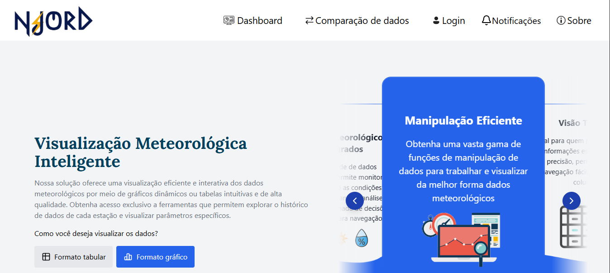
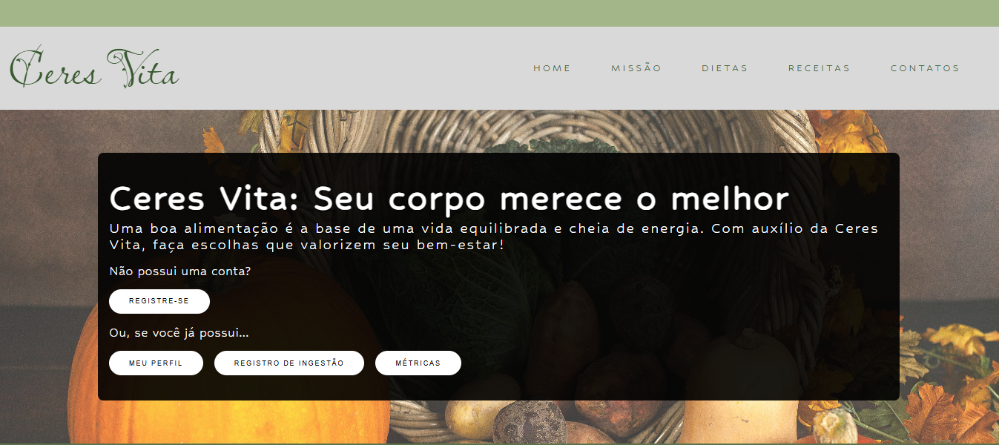

# Documentação

# 🌐 Portfólio - Paulo Bueno

Bem-vindo ao meu portfólio! Aqui você encontra meus projetos, tecnologias que utilizo e informações sobre mim.

---

## 🧑 Sobre Mim

Sou estudante de **Desenvolvimento de Software Multiplataformas** na FATEC Jacareí e militar da **Força Aérea Brasileira**.  
Atualmente, estou no 4º semestre e busco aprimorar minhas habilidades em **desenvolvimento web e mobile**, criando projetos modernos e funcionais.

---

## 💻 Tecnologias

Algumas das tecnologias que utilizo:

- **Frontend:** HTML5, CSS3, JavaScript, React, React Native  
- **Backend:** Node.js, Express  
- **Banco de dados:** MongoDB, PostgreSQL  
- **Outras ferramentas:** Git, Trello, Figma, C  

---

## 🚀 Projetos

1. **Njord**  
   Plataforma de monitoramento meteorológico do Lago de Furnas. Desenvolvido com foco educacional, simulando uma aplicação real para análise de dados climáticos.  
   

2. **Ceres**  
   Site para nutrição e hábitos alimentares. Plataforma intuitiva que auxilia os usuários a melhorar seus hábitos alimentares.  
   

3. **Projeto 3**  
   [Descrição resumida do Projeto 3]  
   

---

## 🌙 Dark Mode

O site possui **modo claro e escuro**, ativável pelo botão de lua no header.  
A preferência do usuário é salva, garantindo que o site abra sempre no modo escolhido.

---

## 📂 Estrutura do Projeto

portifolio/
│
├─ index.html
├─ style.css
├─ script.js
├─ carousel.js
├─ img/
│ ├─ perfil.jpg
│ ├─ njord.png
│ ├─ ceres.png
│ └─ projeto3.png
└─ README.md


---

## 🔗 Links

- [LinkedIn](https://www.linkedin.com/in/pauloabueno/)  
- [GitHub](https://github.com/oneubp)  

---

## ⚡ Como visualizar

1. Clone o repositório:
```bash
git clone https://github.com/oneubp/seu-repositorio.git


